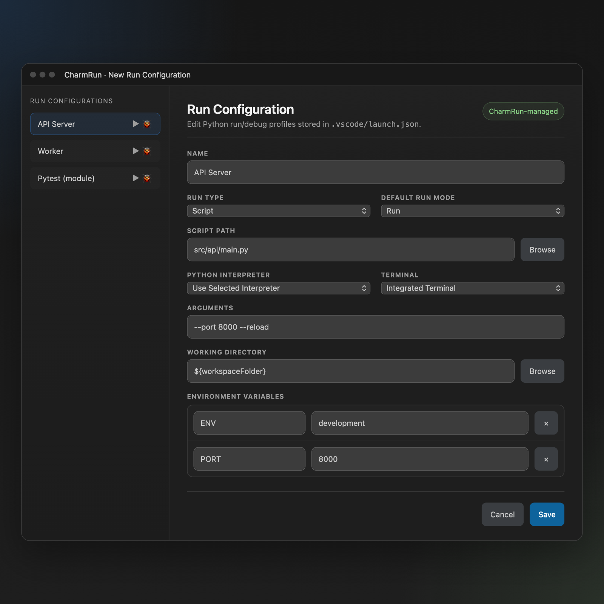

# CharmRun

PyCharm-style Python run configuration management for VS Code, with a GUI editor for Python entries in `launch.json`.

CharmRun lets you create named run/debug profiles (script or module), choose interpreter/args/env/cwd, and launch quickly from the sidebar, status bar, or command palette.



## Features

- GUI editor for Python run configurations
- Script mode (`python script.py`) and module mode (`python -m module_name`)
- Uses `.vscode/launch.json` as the source of truth
- Adopt existing Python `debugpy` launch configurations in place
- Active configuration picker in status bar
- Sidebar tree with inline Run/Debug actions
- Run/debug current Python file without creating a config
- Variable expansion support (`${workspaceFolder}`, `${file}`, `${env:NAME}`, and more)
- Multi-root workspace support

## Requirements

- VS Code `^1.85.0`
- Python installed and available in environment
- Recommended: VS Code Python extension (CharmRun can fall back to configured/default PATH interpreters)

## Install (Development)

```bash
npm install
npm run compile
```

Press `F5` in VS Code to launch an Extension Development Host.

## Usage

1. Open a workspace containing Python code.
2. In the Activity Bar, open **CharmRun**.
3. Click **Add Configuration**.
4. Choose whether to create a new CharmRun-managed config or adopt an existing Python `launch.json` entry.
5. Fill the form and save.
6. Select the active configuration (status bar or command palette).
7. Run or debug using:
   - status bar buttons (`play` / `bug`)
   - tree inline actions
   - command palette commands
8. If you want to skip the combined flow, use `CharmRun: Create Configuration` to create directly or `CharmRun: Adopt launch.json Configuration` to adopt directly.

## Commands

- `CharmRun: Run Configuration` (`charmrun.runConfiguration`)
- `CharmRun: Debug Configuration` (`charmrun.debugConfiguration`)
- `CharmRun: Run Current Python File` (`charmrun.runCurrentFile`)
- `CharmRun: Debug Current Python File` (`charmrun.debugCurrentFile`)
- `CharmRun: Add Configuration` (`charmrun.openConfigurationFlow`)
- `CharmRun: Create Configuration` (`charmrun.createConfiguration`)
- `CharmRun: Edit Configuration` (`charmrun.editConfiguration`)
- `CharmRun: Delete Configuration` (`charmrun.deleteConfiguration`)
- `CharmRun: Duplicate Configuration` (`charmrun.duplicateConfiguration`)
- `CharmRun: Select Active Configuration` (`charmrun.selectActiveConfig`)
- `CharmRun: Adopt launch.json Configuration` (`charmrun.adoptLaunchConfiguration`)
- `CharmRun: Refresh Configurations` (`charmrun.refreshConfigurations`)

## Configuration File

CharmRun stores managed configs in:

`<workspace>/.vscode/launch.json`

CharmRun only manages entries it created or explicitly adopted. Other `launch.json` entries are left untouched.

See full format: [docs/CONFIG_FORMAT.md](docs/CONFIG_FORMAT.md)

## Variable Expansion

Supported placeholders:

- `${workspaceFolder}`
- `${workspaceFolderBasename}`
- `${file}`
- `${fileBasename}`
- `${fileBasenameNoExtension}`
- `${fileDirname}`
- `${fileExtname}`
- `${relativeFile}`
- `${env:VARNAME}`

Applied to:

- `script`
- `args`
- `cwd`
- `env` values

## Interpreter Resolution

If configuration interpreter is `selected`, CharmRun resolves in this order:

1. Python extension command `python.interpreterPath`
2. `python.defaultInterpreterPath` in workspace settings
3. `python3` then `python` on PATH

If a custom interpreter path/command is provided, CharmRun validates it before launch.

## Build Scripts

- `npm run compile`: Type-check + esbuild bundle
- `npm run watch`: Type-check + bundling in watch mode
- `npm run package`: Production bundle for publishing

## Project Docs

- [docs/ARCHITECTURE.md](docs/ARCHITECTURE.md)
- [docs/CONFIG_FORMAT.md](docs/CONFIG_FORMAT.md)
- [CONTRIBUTING.md](CONTRIBUTING.md)
- [FEATURE_SPEC.md](FEATURE_SPEC.md)
- [worklog.md](worklog.md)

## License

MIT - see [LICENSE](LICENSE)
